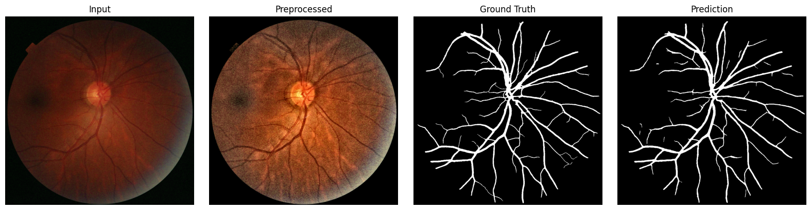
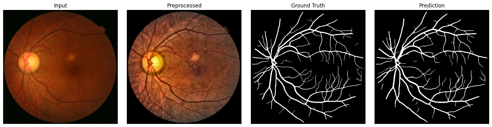
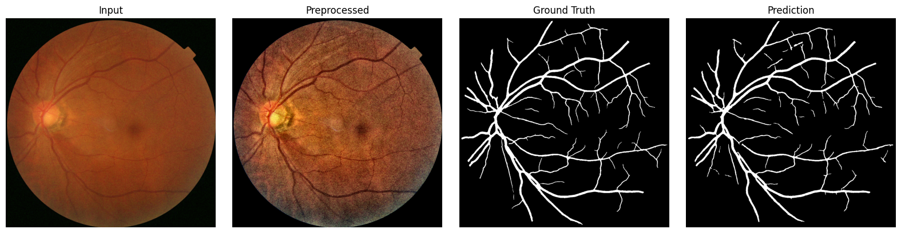

# Retinal Vessel Segmentation with U-Net
This project focuses on automated retinal vessel segmentation from fundus images using a deep learning pipeline based on U-Net.

## Project Overview
Retinal vessel segmentation is a key step in the analysis of fundus images, as vascular structures provide important information for diseases such as diabetic retinopathy, glaucoma, and cardiovascular conditions.
In this project, a complete pipeline was developed including preprocessing, deep learning segmentation, and post-processing.

## Pipeline
The implemented pipeline consists of:
- ROI extraction to isolate the retinal region  
- Color normalization in LAB color space  
- Contrast enhancement using CLAHE  
- Gaussian filtering for noise reduction  
- U-Net architecture for segmentation  
- Post-processing (removal of small objects)  
- Skeletonization of vessels  

## Model
- Architecture: U-Net  
- Input size: 1024x1024  
- Loss: BCEWithLogitsLoss  
- Optimizer: Adam  
- Epochs: 20  
- Batch size: 4  

## Results
The final pipeline improves segmentation performance compared to the baseline and shows good generalization on unseen data.

## Technologies
- Python  
- PyTorch  
- OpenCV  
- NumPy  

## Notes
This project was developed as part of the Medical Image Processing course in the MSc in Biomedical Engineering at Politecnico di Torino.

## Results
### Example 1

### Example 2

### Example 3

